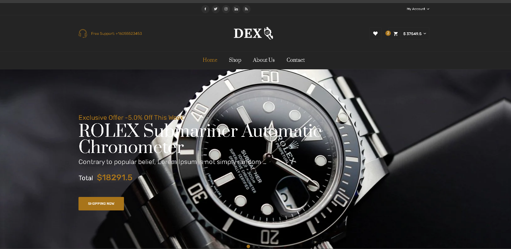
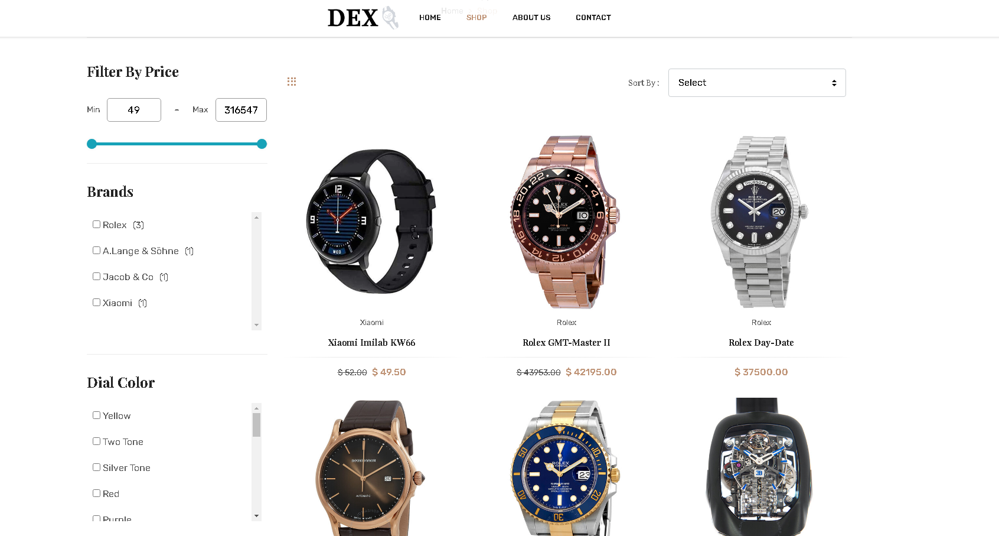
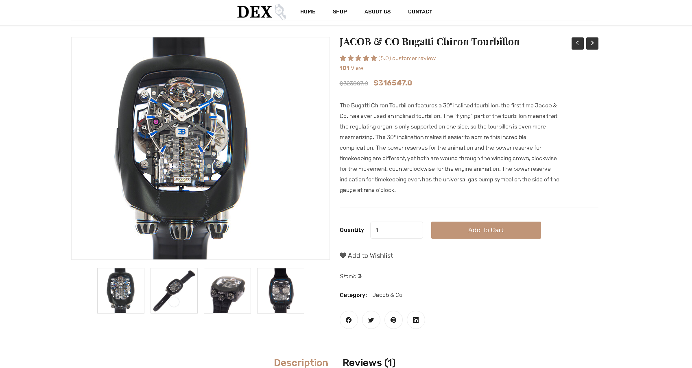
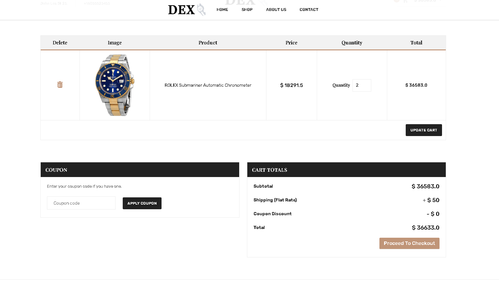

# Dex E-Commerce

<div style="display: flex;">
    
    
    </div>
<div style="display: flex">
    
    
</div>

## Description

The project I made is a watch e-commerce web application. In the project, I created an account system and dashboard where users can manage their accounts. I made a basket system and an ordering system for shopping. I created many features in the project, such as a review system and wishlist.
<br>
In the project, I used Python's Django framework in the backend and Jquery in the frontend.

## Installation

```bash
git clone https://github.com/ibrahimmuradov/dex-watch-e-commerce.git .
pip install -r requirements.txt
django-admin startproject core . 
py manage.py migrate
py manage.py createsuperuser
py manage.py runserver
```